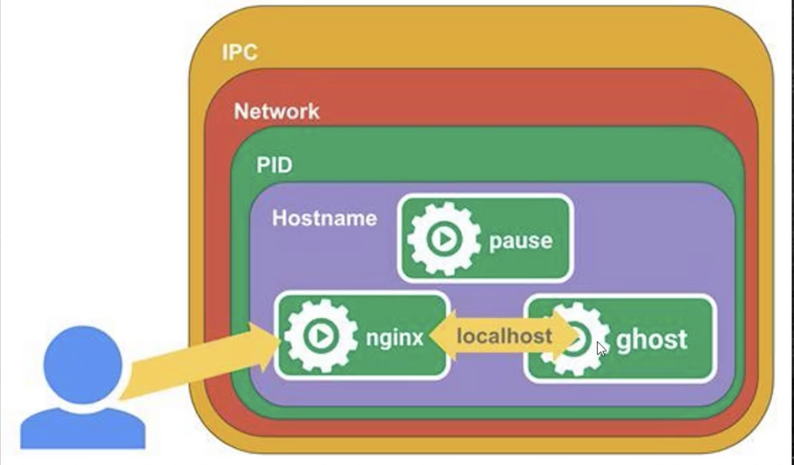

### 1. 内容编排与kubernetes介绍

支持集群环境内容编排的工具kubernetes 简称k8s.

k8s是谷歌官方提供的，底层基于docker，与docker-swarm是竞争关系。

集群容器管理领域几乎都是采用的k8s。

**k8s的职责**

- 自动化容器的部署和复制

- 随时扩展或收缩容器规模
- 容器分组Group，并且提供容器间的负载均衡
- 实时监控，即时故障发现，自动替换


### 2.k8s基本概念


- k8s Master 主节点
- Node 节点
- Service 服务
- Replication Controller 复制控制器
- Label 标签
- Container 容器
- Pod  k8s最小控制单元

**Master**

​		是集群的网关和中枢枢纽，主要作用：暴露API接口，跟踪其他服务器的健康状态、以最优方式调度负载，以及编排其他组件之间的通信。单个的Master节点可以完成所有的功能，但是考虑单点故障的痛点，生产环境中通常要部署多个Master节点，组成Cluster.

**Node**

​		是k8s的工作节点，负责接收来自Master的工作指令，并根据指令相应地创建和销毁Pod对象，以及调整网络规则进行合理路由和流量转发。生产环境中，Node节点可以有N个。

**Pod**

- pod是容器的容器，可以包含多个Container
- pod是k8s最小的可部署的单元，一个Pod就是一个进程
- pod内部容器的网络互通，每个pod都有独立的虚拟ip
- pod都是部署完整的应用或者模块




kubelet    kube-proxy   docker


### 3. k8s安装

国内安装k8s途径

- **使用kubeadmin离线安装**
- 使用阿里公有云平台k8s
- 通过yum官方仓库
- 二进制包形式安装，kubeasz


#### 3.1 安装kubeadmin加载k8s镜像

```shell
# 以下命令在三台虚拟机执行 yz10  yz20  yz21
mkdir /usr/local/k8s-install
cd /usr/local/k8s-install

```

