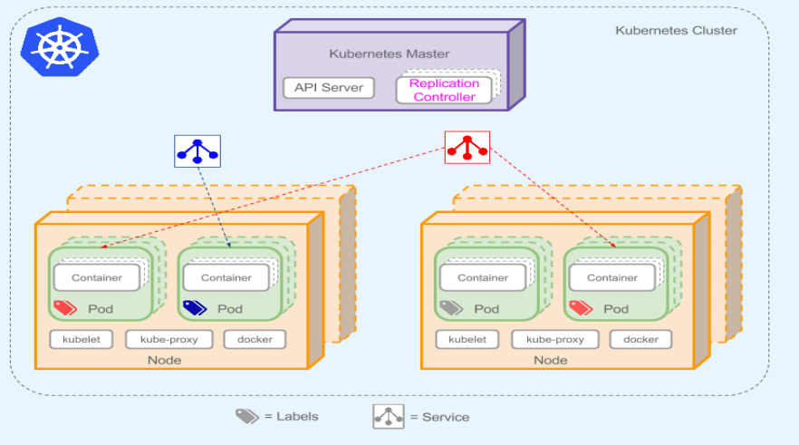
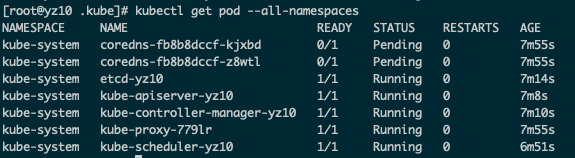
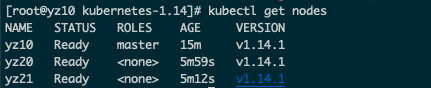
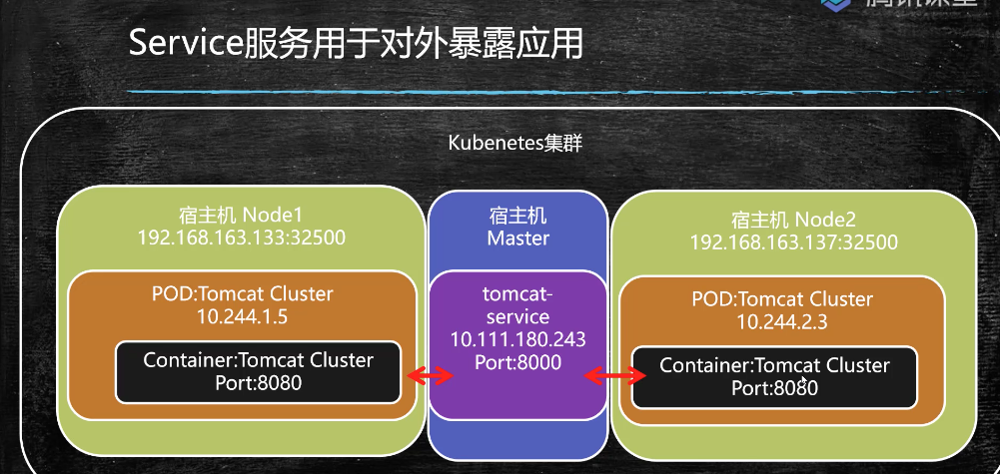
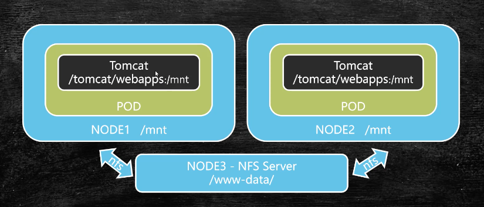
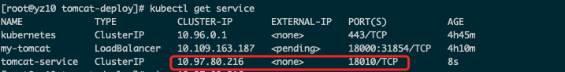
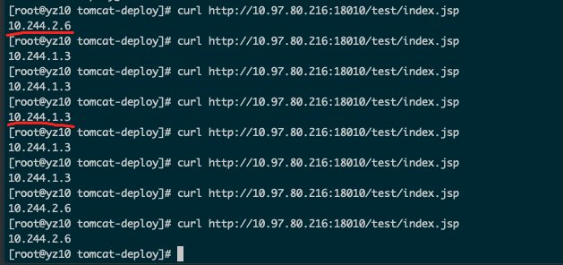

### 1. 内容编排与kubernetes介绍

支持集群环境内容编排的工具kubernetes 简称k8s.

k8s是谷歌官方提供的，底层基于docker，与docker-swarm是竞争关系。

集群容器管理领域几乎都是采用的k8s。

**k8s的职责**

- 自动化容器的部署和复制

- 随时扩展或收缩容器规模
- 容器分组Group，并且提供容器间的负载均衡
- 实时监控，即时故障发现，自动替换


### 2.k8s基本概念



- k8s Master 主节点
- Node 节点
- Service 服务
- Replication Controller 复制控制器
- Label 标签
- Container 容器
- Pod  k8s最小控制单元

**Master**

​	是集群的网关和中枢枢纽，主要作用：暴露API接口，跟踪其他服务器的健康状态、以最优方式调度负载，以及编排其他组件之间的通信。单个的Master节点可以完成所有的功能，但是考虑单点故障的痛点，生产环境中通常要部署多个Master节点，组成Cluster.

**Node**

​	是k8s的工作节点，负责接收来自Master的工作指令，并根据指令相应地创建和销毁Pod对象，以及调整网络规则进行合理路由和流量转发。生产环境中，Node节点可以有N个。

**Pod**

- pod是容器的容器，可以包含多个Container
- 是k8s最小的可部署的单元，一个Pod就是一个进程
- pod内部容器的网络互通，每个pod都有独立的虚拟ip
- pod都是部署完整的应用或者模块


### 4. k8s离线部署

```
10.211.55.10  yz10   Master节点
10.211.55.20  yz20   Node节点
10.211.55.21  yz21   Node节点
```

```shell
# 1. 调整时区
timedatectl set-timezone Asia/Shanghai
# 2. 关闭selinux和防火墙
sed -i 's/SELINUX=enforcing/SELINUX=disabled/g' /etc/selinux/config
setenforce 0
systemctl disable firewalld
systemctl stop firewalld
# 3. k8sadmin镜像下载附带对应的docker
# 4. 镜像上传到每个节点
mkdir -p /usr/local/k8s-install
scp -r kubernetes-1.14 root@yz10:/usr/local/k8s-install

# 5. 安装docker，记得配置加速器
tar -xf docker-ce-18.09.tar.gz
cd docker 
yum localinstall -y *.rpm

# 6. 确认cgroup为 cgroupfs
docker info|grep cgroup
# 7. 安装kubeadm
tar -xf kube114-rpm.tar.gz
cd kube114-rpm
yum localinstall -y *.rpm

# 8. 关闭交换区
swapoff -a  #关闭
vi /etc/fstab
# 注释这行 永久关闭
#/dev/mapper/centos-swap swap                    swap    defaults        0 0

# 9. 配置网桥
cat <<EOF > /etc/sysctl.d/k8s.conf
net.bridge.bridge-nf-call-ip6tables = 1
net.bridge.bridge-nf-call-iptables = 1
EOF
sysctl --system

# 10. 通过镜像安装k8s
docker load -i k8s-114-images.tar.gz
docker load -i flannel-dashboard.tar.gz
```


### 5. 构建k8s集群

确保上述节点都已经安装好了k8s。

```shell
# master主服务器网络设置
kubeadm init --kubernetes-version v1.14.1 --pod-network-cidr 10.244.0.0/16

# 运行完毕后查看需要手动运行的命令
mkdir -p $HOME/.kube
sudo cp -i /etc/kubernetes/admin.conf $HOME/.kube/config
sudo chown $(id -u):$(id -g) $HOME/.kube/config
    
# 查看节点， 可以看到只有一个master节点
kubectl get nodes
NAME   STATUS     ROLES    AGE     VERSION
yz10   NotReady   master   5m21s   v1.14.1

# 查看存在问题的pod
kubectl get pod --all-namespaces

```



```shell
# pending 是需要安装flannel网络组件
kubectl create -f /usr/local/k8s-install/kubernetes-1.14/kube-flannel.yml

# 再次查看，已经处于running状态
kubectl get pod --all-namespaces

# 查看master的token 
kubeadm token list

# 其余节点加入master节点集群
kubeadm join 10.211.55.10:6443 --token 63zvtd.rej4gqrhselysqsb --discovery-token-unsafe-skip-ca-verification 
```

master节点运行: kubectl get nodes



可以看到，集群已经部署完毕。


### 6. k8s设置重启服务

- kubeadm 是k8s集群快速构建工具
- kubelet 运行在所有节点上，负责启动pod和容器，以系统服务的形式出现
- kubectl 是k8s命令行工具，提供指令

systemctl start kubelet

设置开机启动  systemctl enable kubelet


### 7.开启WebUI Dashboard

```shell
# master开启仪表盘
kubectl apply -f kubernetes-dashboard.yaml
kubectl apply -f admin-role.yaml
kubectl apply -f kubernetes-dashboard-admin.rbac.yaml

kubectl -n kube-system get svc

# 查看pod情况，dashbord running正常
kubectl get pods --all-namespaces

# 遇到问题可以删除pod，重新配置
kubectl -n kube-system delete pod/{podName}
```

访问 http://宿主机ip:32000/ 即可进入dashbord

### 8.dashbord 部署tomcat集群

工作负载 -》 创建 即可


### 9.deployment脚本部署tomcat集群

- 部署是指k8s向node节点发送指令创建容器的过程
- k8s支持yml格式的部署脚本
- kubectl create -f  部署文件.yml 

编写第一个k8s部署脚本文件：

```yaml
apiVersion: extensions/v1beta1
kind: Deployment
metadata: 
  name: tomcat-deploy
spec: 
  replicas: 2
  template: 
    metadata:
      labels:
        app: tomcat-cluster
    spec: 
      containers: 
      - name: tomcat-cluster
        image: tomcat
        ports: 
        - containerPort: 8080
```

**与部署相关的常用命令：**

- kubectl create -f 部署文件.yml    -》 创建部署
- kubectl apply -f 部署文件.yml     -》  更新部署配置
- kubectl get pod [-o wide]            -》 查看已部署pod
- kubectl describe pod pod名称   -》 查看pod详细信息
- kubectl logs [-f] pod名称            -》 查看pod输出日志

```shell
# 创建tomcat容器
kubectl create -f tomcat-deploy.yml

# 查看部署
kubectl get deployment
```


### 10. 外部访问tomcat集群

service 服务用于对外暴露应用。



编写服务 tomcat-service.yml

```yaml
apiVersion: v1
kind: Service
metadata: 
  name: tomcat-service
  labels: 
    app: tomcat-service
spec:
  type: NodePort
  selector: 
    app: tomcat-cluster
  ports: 
  - port: 18010
    targetPort: 8080
    nodePort: 32500
```

```shell
# 创建负载均衡服务
kubectl create -f tomcat-service.yml

# 查看服务
kubectl get service
```


### 11. 基于NFS实现集群文件共享

- nfs主要是采用远程过程调用RPC机制实现文件传输
- yum install -y nfs-utils rpcbind



```shell
# 编辑nfs共享文件设置
vi /etc/exports

/usr/local/data/www-data  10.211.55.10/24(rw,sync)
```

```shell
systemctl start nfs.service
systemctl start rpcbind.service

systemctl enable nfs.service
systemctl enable rpcbind.service

# exportfs查看
exportfs
/usr/local/data/www-data
		10.211.55.10/24  # 说明配置生效
		
# 节点安装工具
yum install -y nfs-utils

# 节点安装完毕后
showmount -e yz10
 
# 挂载文件
mkdir -p /mnt/www-data
mount yz10:/usr/local/data/www-data /mnt/www-data
```


### 12. 部署配置挂载点

```shell
# 查看deployment
kubectl get deployment

# 删除部署,服务service
kubectl delete deployment tomcat-deploy
kubectl delete service tomcat-service

# 重新部署挂载
vi tomcat-deploy.yml # 修改部署文件
```

```yaml
apiVersion: extensions/v1beta1
kind: Deployment
metadata:
  name: tomcat-deploy
spec:
  replicas: 2
  template:
    metadata:
      labels:
        app: tomcat-cluster
    spec:
      volumes: 
      - name: webapp
        hostPath: 
          path: /mnt/www-data
      containers:
      - name: tomcat-cluster
        image: tomcat
        ports:
        - containerPort: 8080
        volumeMounts: 
        - name: webapp
          mountPath: /usr/local/tomcat/webapps
```

```shell
# 进入pod查看挂载是否成功
kubectl exec -it tomcat-deploy-6dcc5c59c-hg5z7 bash
```


### 13. 利用 Rinetd 对外提供Service以及负载均衡支持

vi tomcat-service.yml  修改服务文件

```yaml
apiVersion: v1
kind: Service
metadata:
  name: tomcat-service
  labels:
    app: tomcat-service
spec:
#  type: NodePort
  selector:
    app: tomcat-cluster
  ports:
  - port: 18010
    targetPort: 8080
#    nodePort: 32500
```

 

```shell
# 创建服务
kubectl create -f tomcat-service.yml
# 在www-data 创建一个test目录创建文件
vi index.jsp
<%=request.getLocalAddr()%>

# 访问
curl http://10.97.80.216:18010/test/index.jsp
```





可以观察到随机负载均衡的效果。

**端口转发工具 Rinetd**

- Rinetd 是Linux操作系统中为重定向传输控制协议工具
- 可以将源ip端口数据转发到目标ip端口
- 在k8s中用于将service服务对外暴露

```shell
# 宿主机安装Rinted
cd /usr/local
http://www.rinetd.com/download/rinetd.tar.gz
cd rinetd
sed -i 's/65536/65535/g' rinetd.c
mkdir -p /usr/man/
yum install -y gcc
make && make install

# 编写端口映射配置
vi /etc/rinetd.conf
0.0.0.0 18010 10.97.80.216 18010

# 加载配置
rinetd -c /etc/rinetd.conf

# 测试外部访问，已经可以通了
http://yz10:18010/test/
```


### 14. 更新集群配置与资源限定

**k8s部署调整命令**

- 更新集群配置: kubectl apply -f yml文件
- 删除部署|服务|pod  
- kubectl delete deployment | service | pod 名称

**资源限定**

```yaml
containers: 
- name: tomcat-cluster
  image: tomcat
  resources: 
    requests:  # 需要的资源
      cpu: 1
      memory: 500Mi
    limits:    # 限制的资源
      cpu: 2   # cpu不一定是整数
      memory: 1024Mi
```

